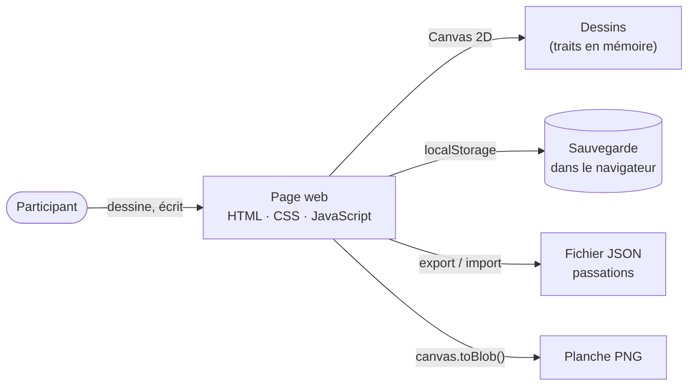

# ArtificialInquiries_1 — « Draw It Like You See It »

Transformation en outil numérique de l'**exercice 1** du vademecum *Artificial Inquiries: A Vademecum for Workers in the Age of AI* (Alcaras, Ricci, Prinetti, de Vries, médialab Sciences Po, 2025 — [https://hal.science/hal-05327878](https://hal.science/hal-05327878)).

---

## 1. L'exercice

**Bloc 01 — Qualifying, exercice 1 (p. 6-7).** C'est le premier exercice du livre : avant de documenter son usage des LLM, on fixe sa représentation de départ.

Sur papier, la page contient :

- **deux carrés à dessiner**, sans faire de recherche, de tête :
  1. à quoi ressemble un LLM (comment on imagine son fonctionnement) ;
  2. à quoi ressemble son environnement de travail ;
- **une question écrite** : « En quelques mots, que fais-tu ? ».

L'intérêt est de **comparer les deux dessins** : est-ce que le LLM apparaît dans le dessin du travail ? Qu'est-ce qui revient dans les deux ?

## 2. Pourquoi un outil numérique

Sur papier, on n'a qu'une page et on ne la refait pas. En numérique :

- on peut **refaire l'exercice à plusieurs moments** (avant les autres exercices, après le bloc 03, à la fin…) et comparer comment la vision évolue ;
- les dessins sont **enregistrés** et on peut les **rejouer** trait par trait ;
- on peut **exporter** une planche PNG (les deux dessins + les réponses) pour la partager.

## 3. Fonctionnalités

| Fonction | Détail |
|---|---|
| Dessin | 2 carrés, crayon / feutre / gomme, 5 couleurs, 3 épaisseurs, souris, doigt ou stylet |
| Annuler / effacer | par carré, trait par trait |
| Questions écrites | « Que fais-tu ? » (+ une question de comparaison des deux dessins, optionnelle) |
| Passations | chaque remplissage est une passation datée, avec un « moment » (avant / après…) |
| Sauvegarde | automatique dans le navigateur, et export / import d'un fichier JSON |
| Historique | liste de ses passations, affichage côte à côte pour comparer |
| Export | planche PNG avec les deux dessins et les réponses |

## 4. Solutions techniques

### Architecture



### La page de dessin

- **HTML / CSS / JavaScript** sans framework, une seule page, qui s'ouvre dans n'importe quel navigateur.
- **Canvas 2D + Pointer Events** : le même code gère souris, doigt et stylet (`pointerdown`, `pointermove`, `getCoalescedEvents()` pour des traits fluides).
- Chaque trait est gardé en mémoire comme un objet `{outil, couleur, epaisseur, points[]}` : on peut **annuler** (on retire le dernier trait et on redessine) et **rejouer** un dessin.

### Les données

- Le modèle de données est décrit dans **[diagram_class.md](diagram_class.md)** (participant, passation, questions, réponses dessin et texte, traits).
- Les passations sont **sauvegardées automatiquement** dans le navigateur (`localStorage`) : on peut fermer la page et revenir.
- On peut **exporter toutes ses passations en JSON** et les réimporter, par exemple sur un autre ordinateur.
- Les dessins sont stockés comme **listes de traits** (et pas seulement comme images) : c'est ce qui permet d'annuler, de rejouer et de comparer.

### Les exports

- **PNG** avec `canvas.toBlob()` : une image par carré, plus une planche complète avec les deux dessins et les réponses.
- **JSON** : toutes les passations, dans le format du diagramme de classes.

## 5. Structure du dépôt

```
ArtificialInquiries_1/
├── README.md           description de l'exercice et solutions techniques
└── diagram_class.md    diagramme de classes Mermaid
```

## 6. Références

- Alcaras G., Ricci D., Prinetti T., de Vries Z. (2025). *Artificial Inquiries*. Éditions Annexes / médialab Sciences Po. [https://hal.science/hal-05327878](https://hal.science/hal-05327878)
- Mermaid, diagramme de classes : [https://mermaid.ai/open-source/syntax/classDiagram.html](https://mermaid.ai/open-source/syntax/classDiagram.html) — éditeur en ligne : [https://mermaid.live/](https://mermaid.live/)
