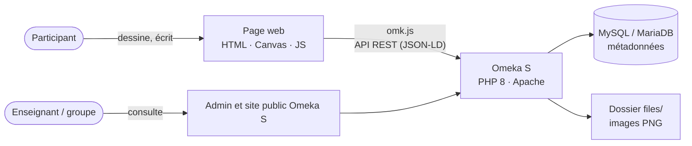

# ArtificialInquiries_1 — « Draw It Like You See It »

Transformation en outil numérique de l'**exercice 1** du vademecum *Artificial Inquiries: A Vademecum for Workers in the Age of AI* (Alcaras, Ricci, Prinetti, de Vries, médialab Sciences Po, 2025 — [https://hal.science/hal-05327878](https://hal.science/hal-05327878)).

---

## 1. L'exercice

**Bloc 01 — Qualifying, exercice 1 (p. 6-7).** C'est le premier exercice du livre : avant de documenter son usage des LLM, on fixe sa représentation de départ.

Sur papier, la page contient :

- **deux carrés à dessiner**, sans faire de recherche, de tête :
  1. à quoi ressemble un LLM (comment on imagine son fonctionnement) ;
  2. à quoi ressemble son environnement de travail ;
- **une question écrite** : « En quelques mots, que fais-tu ? ».

L'intérêt est de **comparer les deux dessins** : est-ce que le LLM apparaît dans le dessin du travail ? Qu'est-ce qui revient dans les deux ?

## 2. Pourquoi un outil numérique

Sur papier, on n'a qu'une page et on ne la refait pas. En numérique :

- on peut **refaire l'exercice à plusieurs moments** (avant les autres exercices, après le bloc 03, à la fin…) et comparer comment la vision évolue ;
- chaque passation est **enregistrée dans une base** (Omeka S) et pas seulement dans le navigateur ;
- les dessins de plusieurs participants forment un **corpus** consultable par le groupe et l'enseignant ;
- on peut **exporter** une planche PNG (les deux dessins + les réponses).

## 3. Fonctionnalités

| Fonction | Détail |
|---|---|
| Dessin | 2 carrés, crayon / feutre / gomme, 5 couleurs, 3 épaisseurs, souris, doigt ou stylet |
| Annuler / effacer | par carré, trait par trait |
| Questions écrites | « Que fais-tu ? » (+ une question de comparaison des deux dessins, optionnelle) |
| Passations | chaque remplissage est une passation datée, avec un « moment » (avant / après…) |
| Sauvegarde | dans Omeka S : un item par passation, un item par réponse, l'image PNG en média |
| Historique | liste de ses passations, affichage côte à côte pour comparer |
| Export | planche PNG avec les deux dessins et les réponses |

## 4. Solutions techniques

### Architecture



### Front : la page de dessin

- **HTML / CSS / JavaScript** sans framework, une seule page.
- **Canvas 2D + Pointer Events** : le même code gère souris, doigt et stylet (`pointerdown`, `pointermove`, `getCoalescedEvents()` pour des traits fluides).
- Chaque trait est gardé en mémoire comme un objet `{outil, couleur, epaisseur, points[]}` : on peut **annuler** (on retire le dernier trait et on redessine), **rejouer** un dessin, et le **sauvegarder en JSON**.
- **Export PNG** avec `canvas.toBlob()` : une image par carré, plus une planche complète.

### Back : Omeka S

[Omeka S](https://omeka.org/s/) (PHP + MySQL, servi par Apache) sert de base de données et d'interface d'administration :

- chaque objet du modèle (passation, réponse, question…) est un **item** Omeka S ;
- les items sont décrits avec les **vocabulaires installés par défaut** : Dublin Core (`dcterms`), DCMI Type (`dctype`), FOAF (`foaf`), BIBO (`bibo`) ;
- un **modèle de ressource** (*resource template*) par type d'objet fixe les propriétés attendues ;
- les **images PNG** des dessins sont des **médias** attachés aux items (stockées dans `files/`, miniatures générées par GD) ;
- les traits (JSON) sont stockés en texte dans `bibo:content`, ce qui permet de rejouer le dessin ;
- tout est accessible par l'**API REST** d'Omeka S (`/api/items`, `/api/media`…), en JSON-LD.

Le modèle de données et la correspondance avec Omeka S sont détaillés dans **[diagram_class.md](diagram_class.md)**.

### Lien front ↔ back : omk.js

La page parle à Omeka S avec **omk.js**, la classe JavaScript de Samuel Szoniecky pour l'API Omeka S ([source](https://github.com/samszo/validExpertises/blob/main/assets/js/omk.js)) :

| Besoin | Méthode omk |
|---|---|
| Charger propriétés, classes, modèles | `new omk({...})` (appelle `init()`) |
| Créer une passation ou une réponse texte | `createItem(data)` |
| Créer une réponse dessin avec son PNG | `createRessource({..., file: blob})` (upload multipart) |
| Retrouver les passations d'un participant | `searchItems(query)` / `getAllItems(query)` |
| Modifier une réponse | `updateRessource(id, data)` |
| Supprimer | `deleteItem(item)` |

Les écritures demandent une **clé API** Omeka S (`key_identity` + `key_credential`). Elle n'est **jamais écrite dans le dépôt** : on la saisit dans la page.

## 5. Installation locale (Windows, XAMPP)

Omeka S 4.2 demande Apache (avec `mod_rewrite` et `AllowOverride All`), PHP ≥ 8.1 (extensions PDO, pdo_mysql, mbstring, xml) et MySQL ≥ 5.7.9 ou MariaDB ≥ 10.2.6 ([manuel d'installation](https://omeka.org/s/docs/user-manual/install/)). XAMPP 8.2 fournit tout ça.

1. **Installer XAMPP 8.2** : [https://www.apachefriends.org/download.html](https://www.apachefriends.org/download.html), dans `C:\xampp`. Ouvrir le *XAMPP Control Panel* et démarrer **Apache** et **MySQL**.
2. **Vérifier PHP** : dans `C:\xampp\php\php.ini`, les lignes `extension=gd`, `extension=pdo_mysql` et `extension=mbstring` ne doivent pas commencer par `;`. Redémarrer Apache si on a modifié le fichier.
3. **Créer la base** : [http://localhost/phpmyadmin](http://localhost/phpmyadmin) → *Nouvelle base de données* → nom `omekas`, interclassement `utf8mb4_unicode_ci`.
4. **Télécharger Omeka S** (zip de la dernière version) : [https://github.com/omeka/omeka-s/releases/latest](https://github.com/omeka/omeka-s/releases/latest). Dézipper dans `C:\xampp\htdocs\omeka-s` (le dossier doit contenir directement `index.php`, pas un second dossier `omeka-s`).
5. **Configurer la connexion** dans `C:\xampp\htdocs\omeka-s\config\database.ini` :

   ```ini
   user     = "root"
   password = ""
   dbname   = "omekas"
   host     = "localhost"
   ```

6. **Adapter à Windows** dans `config\local.config.php` :

   ```php
   'cli' => [
       'phpcli_path' => 'C:/xampp/php/php.exe',
   ],
   // ...
   'Omeka\File\Thumbnailer' => 'Omeka\File\Thumbnailer\Gd',
   ```

7. **Finir l'installation** : [http://localhost/omeka-s/admin](http://localhost/omeka-s/admin) → créer le premier utilisateur, titre, fuseau `Europe/Paris`, langue française.
8. **Créer une clé API** : *Utilisateurs* → son compte → *Modifier* → onglet *Clés API* → nouvelle clé. Noter l'**identity** et le **credential** (le credential n'est affiché qu'une fois).
9. **Vérifier l'API** : [http://localhost/omeka-s/api/items](http://localhost/omeka-s/api/items) doit afficher `[]` (ou la liste des items).

En cas d'erreur `No input file specified`, voir la fin du [manuel d'installation](https://omeka.org/s/docs/user-manual/install/#install-on-windows-or-mac-os-development-only) (modification du `.htaccess`).

## 6. Structure du dépôt

```
ArtificialInquiries_1/
├── README.md           description de l'exercice et solutions techniques
└── diagram_class.md    diagramme de classes Mermaid + correspondance Omeka S
```

## 7. Références

- Alcaras G., Ricci D., Prinetti T., de Vries Z. (2025). *Artificial Inquiries*. Éditions Annexes / médialab Sciences Po. [https://hal.science/hal-05327878](https://hal.science/hal-05327878)
- Omeka S, manuel d'installation : [https://omeka.org/s/docs/user-manual/install/](https://omeka.org/s/docs/user-manual/install/)
- API REST d'Omeka S : [https://omeka.org/s/docs/developer/api/](https://omeka.org/s/docs/developer/api/)
- Mermaid, diagramme de classes : [https://mermaid.ai/open-source/syntax/classDiagram.html](https://mermaid.ai/open-source/syntax/classDiagram.html) — éditeur en ligne : [https://mermaid.live/](https://mermaid.live/)
- omk.js : [https://github.com/samszo/validExpertises/blob/main/assets/js/omk.js](https://github.com/samszo/validExpertises/blob/main/assets/js/omk.js)
