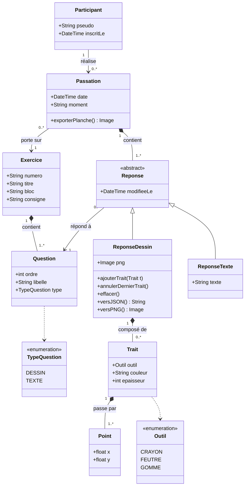

# Diagramme de classes — Exercice 1 « Draw It Like You See It »

Modèle des données nécessaires pour gérer l'exercice : qui fait l'exercice, quand, et ce qu'il a dessiné et écrit.



## Lecture du diagramme

- Un **Participant** réalise plusieurs **Passations** de l'exercice. C'est ce qui permet de refaire l'exercice à différents moments et de comparer.
- Un **Exercice** contient ses **Questions**. Pour l'exercice 1 il y en a trois (tableau ci-dessous). Le modèle reste valable pour d'autres exercices du vademecum.
- Une **Passation** contient une **Réponse** par question. Une réponse est soit un **dessin**, soit un **texte** (héritage).
- Un **dessin** est une suite de **Traits** ; un trait a un outil, une couleur, une épaisseur et une suite de **Points**. Garder les traits (et pas seulement l'image) permet d'annuler et de rejouer le dessin.

### Instances pour l'exercice 1

| Question | ordre | type | libellé |
|---|---|---|---|
| Q1 | 1 | DESSIN | À quoi ressemble un LLM ? |
| Q2 | 2 | DESSIN | À quoi ressemble ton environnement de travail ? |
| Q3 | 3 | TEXTE | En quelques mots, que fais-tu ? |

## Format de sauvegarde (JSON)

Les passations sont enregistrées dans le navigateur et exportables en JSON, avec la même structure que le diagramme. Les traits d'un dessin sont une liste d'objets :

```json
[
  { "outil": "CRAYON", "couleur": "#232a38", "epaisseur": 7,
    "points": [[120.5, 340.0], [131.2, 338.4], [145.0, 335.9]] },
  { "outil": "GOMME", "couleur": null, "epaisseur": 14,
    "points": [[200.0, 210.0], [205.3, 214.8]] }
]
```
